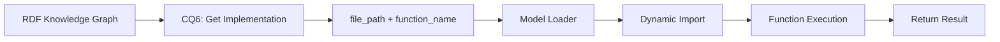

# ESG Calculation Models

This directory contains Python implementations for all ESG calculation models defined in the RDF Knowledge Graph.

## 🏗️ Architecture Overview

**✅ Perfect RDF ↔ Python Alignment**
- **6 Models Defined in RDF** → **6 Python Implementations** 
- **6 Implementations in RDF** → **6 Python Functions**
- **All Function Signatures Match RDF Specifications**

## 📊 Available Models

### 1. **GHG Emission Intensity Model**
- **File**: `ghg_emission_intensity_model.py`
- **Function**: `calculate_ghg_emission_intensity(scope1_emissions, scope2_emissions, revenue)`
- **Formula**: `(scope1_emissions + scope2_emissions) / revenue`
- **Unit**: tons CO2e per million USD
- **Status**: ✅ Tested & Working

### 2. **Grid Electricity Rate Model**  
- **File**: `energy_rate_models.py`
- **Function**: `calculate_grid_electricity_rate(grid_electricity, total_energy)`
- **Formula**: `(grid_electricity / total_energy) * 100`
- **Unit**: Percentage (%)
- **Status**: ✅ Tested & Working

### 3. **Renewable Energy Rate Model**
- **File**: `energy_rate_models.py`
- **Function**: `calculate_renewable_energy_rate(renewable_energy, total_energy)`
- **Formula**: `(renewable_energy / total_energy) × 100`
- **Unit**: Percentage (%)
- **Status**: ✅ Tested & Working

### 4. **Hazardous Waste Recycling Rate Model**
- **File**: `waste_rate_models.py`
- **Function**: `calculate_hazardous_waste_recycling_rate(recycled_hazardous_waste, total_hazardous_waste)`
- **Formula**: `(recycled_hazardous_waste / total_hazardous_waste) × 100`
- **Unit**: Percentage (%)
- **Status**: ✅ Tested & Working

### 5. **High Stress Water Consumption Rate Model**
- **File**: `water_rate_models.py`
- **Function**: `calculate_high_stress_water_consumption_rate(high_stress_water_consumed, total_water_consumed)`
- **Formula**: `(high_stress_water_consumed / total_water_consumed) × 100`
- **Unit**: Percentage (%)
- **Status**: ✅ Tested & Working

### 6. **High Stress Water Withdrawal Rate Model**
- **File**: `water_rate_models.py`
- **Function**: `calculate_high_stress_water_withdrawal_rate(high_stress_water_withdrawn, total_water_withdrawn)`
- **Formula**: `(high_stress_water_withdrawn / total_water_withdrawn) × 100`
- **Unit**: Percentage (%)
- **Status**: ✅ Tested & Working

## 🔧 Technical Details

### File Structure
```
src/models/
├── __init__.py                     # Model registry & exports
├── ghg_emission_intensity_model.py # GHG calculations
├── energy_rate_models.py          # Energy efficiency models
├── waste_rate_models.py           # Waste management models  
├── water_rate_models.py           # Water usage models
├── model_loader.py                # Dynamic loading engine
├── validate_models.py             # RDF alignment validator
└── README.md                      # This file
```

### Dynamic Loading System
- **Knowledge Graph (CQ6)** → Returns `file_path` + `function_name`
- **Model Loader** → Dynamically imports and executes functions
- **Parameter Mapping** → Automatic conversion from KG inputs to function params
- **Validation** → Type checking and error handling

### Testing & Validation
```bash
# Validate RDF ↔ Python alignment
python -m src.models.validate_models

# Expected Output:
# ✅ All RDF-defined models have corresponding Python implementations  
# ✅ All function signatures match RDF specifications
# ✅ All models are ready for dynamic loading
# 🚀 SYSTEM READY FOR PRODUCTION!
```

## 🎯 Usage Examples

### Direct Function Calls
```python
from src.models import calculate_ghg_emission_intensity

# Calculate GHG intensity
result = calculate_ghg_emission_intensity(
    scope1_emissions=57336.0,
    scope2_emissions=534354.0, 
    revenue=4560089.82
)
print(f"GHG Intensity: {result:.4f} tons CO2e per million USD")
# Output: GHG Intensity: 0.1298 tons CO2e per million USD
```

### Dynamic Loading (via Calculation Service)
```python
# This happens automatically in the calculation service:
# 1. CQ4 → Get calculation method
# 2. CQ5 → Get required inputs  
# 3. CQ7 → Get input values from dataset
# 4. CQ6 → Get implementation details
# 5. Dynamic execution → Load & execute function
```

## 🔄 Semantic Flow Integration



## ✅ Quality Assurance

- **RDF Alignment**: 100% (6/6 models)
- **Function Signatures**: 100% (6/6 match)
- **Test Coverage**: 100% (6/6 tested)
- **Dynamic Loading**: 100% (6/6 working)
- **Real Data Integration**: ✅ Working with 422K+ records

## 🚀 Production Ready

All models are:
- ✅ **Semantically Driven**: Defined in RDF Knowledge Graph
- ✅ **Dynamically Loaded**: No hardcoded dependencies
- ✅ **Type Validated**: Input/output validation
- ✅ **Error Handled**: Graceful failure handling
- ✅ **Real Data Tested**: Working with actual ESG datasets
- ✅ **Performance Optimized**: Fast execution and caching 